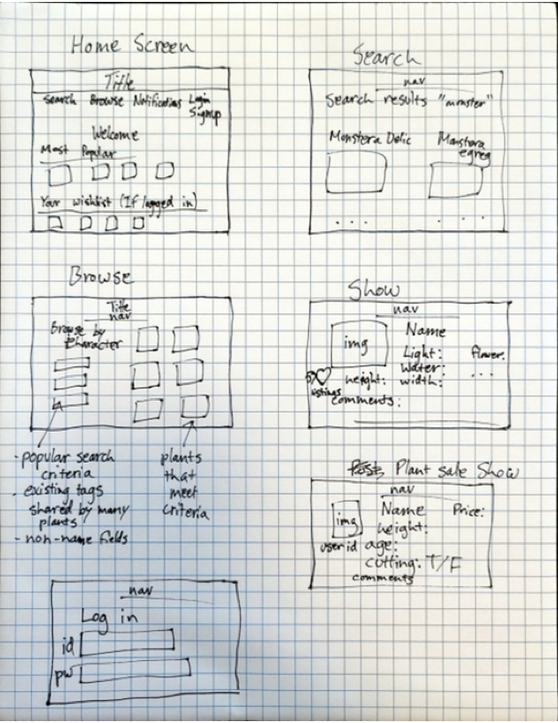
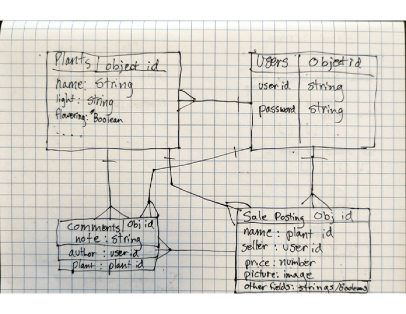

# Houseplant Encyclopedia and Marketplace
---
## Overview
---
Inspired by my love of houseplants, and the realization that I had some plants that people would actually pay money for, (insert app name) is a full-stack app that allows users to search for houseplants by name, characteristics, or care requirements. It also functions as a marketplace to buy, sell, or trade plants or cuttings.
---
### Technologies Used
- HTML
- CSS
- JavaScript
- Liquid
- Bootstrap
- Express
- MongoDB
- Mongoose
- dotenv
- Morgan
- Node

---

## User Stories
---
```
As a user I want the ability to:
-sign up
-log in
-log out
-search for plants by name
-search for plants by characteristics (flowering, variegated, etc.)
-search for plants by care requirements (light, water, etc.)
-add plants to my wishlist
-comment on plants with information
-post plants for sale
-respond to sale posts
-get notified when a plant on my wishlist is for sale
-message other users
```

## Wireframes
---


## ERDs
---


## Route Tables for Documents
---
## Users
---

| **URL**       |   **HTTP Verb**|  **Action** |
| ----------- | ----------- | ----|
| /auth/signup     | GET       | new      |
| /auth/signup  |    POST      | create     |
| /auth/login  |    GET      | login     |
| /auth/login  |    POST      | create     |
| /auth/edit/:userId  |    GET     | edit    |
| /auth/:userId  |    PUT    | update    |
| /auth/:userId  |    GET     | show     |

---
## Plants
---
| **URL**       |   **HTTP Verb**|  **Action** |
| ----------- | ----------- | ----|
| /plants    | GET       | index     |
| /plants/category/:category  |    GET     | index     |
| /plants/:id  |    GET      | show    |
| /plants/water/:water|   GET  |  index   |

---

## Sale Postings
---
| **URL**       |   **HTTP Verb**|  **Action** |
| ----------- | ----------- | ----|
| /sale    | GET       | index     |
| /sale/new/:plantId  |    GET     | new     |
| /sale/new/:plantId  |    POST      | create    |
| /sale/mine  |    GET      | index    |
| /sale/edit/:id  |    GET      | edit    |
| /sale/:id  |    PUT      | update    |
| /sale/:id  |    DELETE      | destroy    |
| /sale/plant/:plantId  |    GET      | index    |
| /sale/:id  |    GET      | show   |

---

## Direct Messages
---
| **URL**       |   **HTTP Verb**|  **Action** |
| ----------- | ----------- | ----|
| /message/threads   | GET       | index     |
| /message/:receiverId  |    POST     | create     |
| /message/:receiverId  |    GET     | index     |
| /message/:id  |    DELETE     | destroy     |